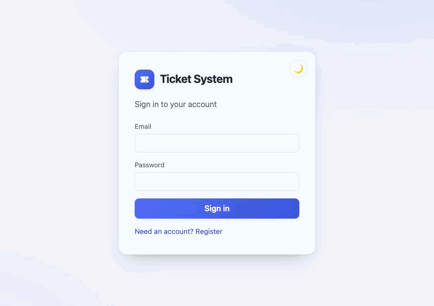
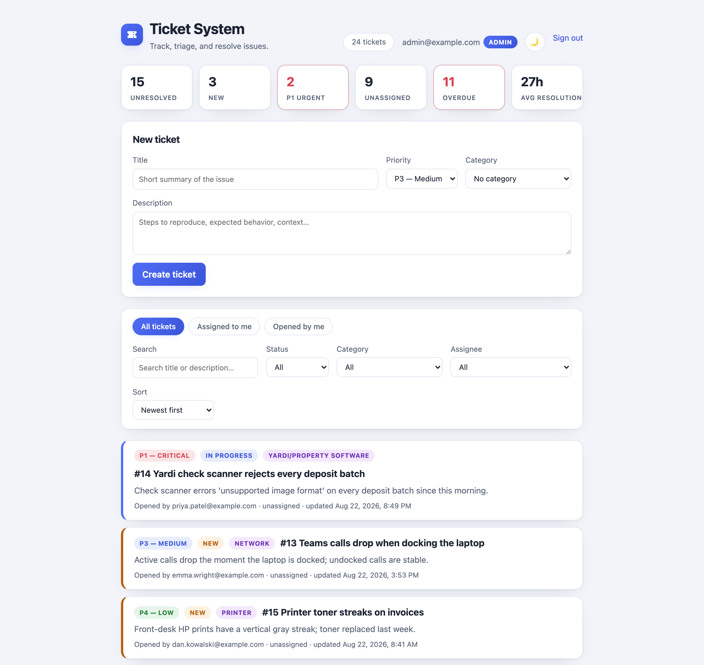
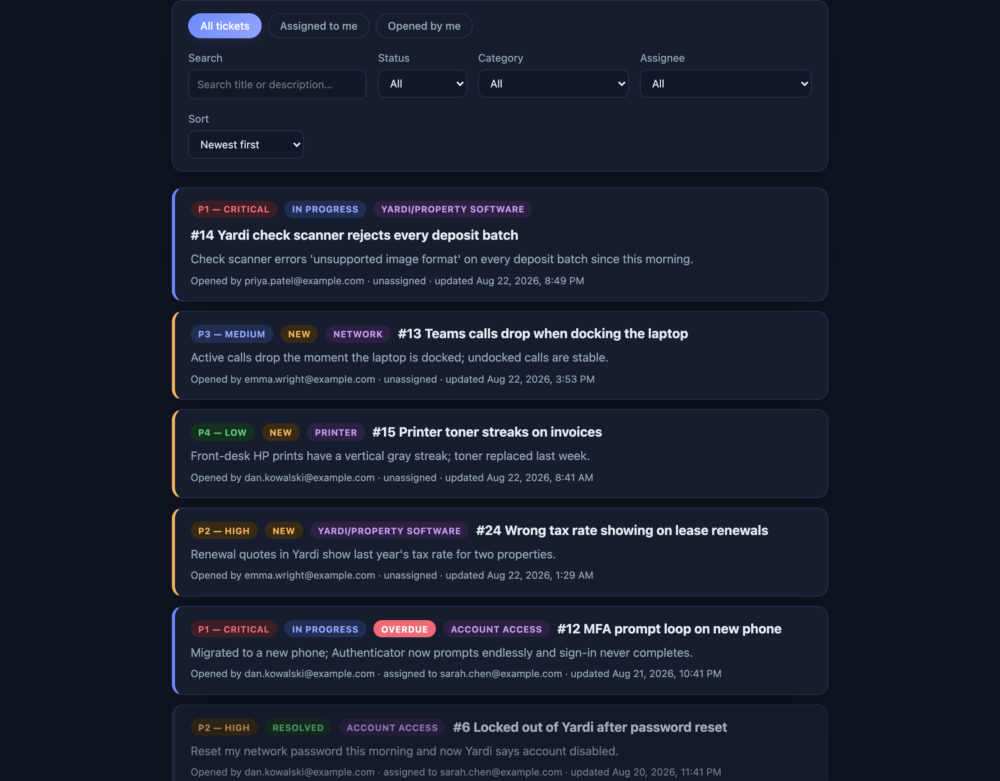
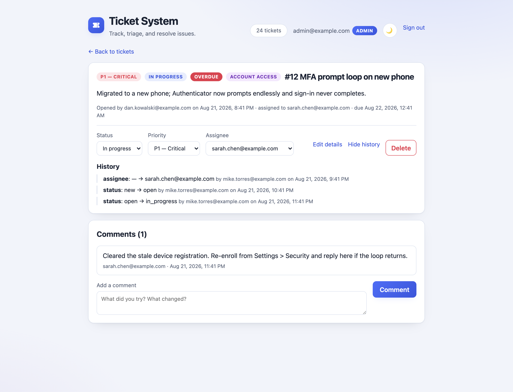

# Ticket Management System

A full-stack helpdesk ticket tracker: **FastAPI + PostgreSQL** backend, **React + Vite** frontend, JWT authentication with role-based access control, audit logging, email notifications, and CI/CD via GitHub Actions.

Built from real helpdesk domain experience: an enforced status lifecycle, assignment, priority triage with SLA due dates, comments, and a full audit trail — the things a real ticket system actually needs.

## Demo



| Light | Dark |
| --- | --- |
|  |  |



## Architecture

```
React (Vite) ──/auth /tickets /users /categories──▶ FastAPI ──▶ PostgreSQL (SQLite in dev)
                                                      │
                                                      └──▶ SendGrid (assignment emails,
                                                           failures logged, never fatal)
GitHub Actions: ruff + migration check + pytest + oxlint + vitest + client build on every
push; deploy hook on merge to main
```

| Layer | Component | Purpose |
| --- | --- | --- |
| Backend | Auth (JWT) | Registration, login, bcrypt hashing, role checks, login/register rate limiting |
| Backend | Ticket logic | CRUD with an enforced status lifecycle, visibility scoping, filtering, pagination, search, sorting, SLA due dates, queue stats |
| Backend | Audit logging | Records every ticket change (status, assignment, priority, title, description, category) |
| Data | SQLAlchemy + Alembic | Users, Tickets, Comments, Categories, AuditLogEntries |
| Integration | Email API | Notifies the assignee when a ticket is assigned |
| Frontend | React UI | Login/register, stats dashboard, queue views, ticket detail with editing/comments/history, dark mode |
| CI/CD | GitHub Actions | Backend + frontend tests, lint, and migration verification on push; automated deploy on merge to `main` |

## Quick start

**With Docker** (Postgres 16 + API + client, the prod-shaped stack):

```bash
docker compose up --build
docker compose exec api python -m app.seed --demo   # first run: demo data
```

UI at http://localhost:5173, API at http://localhost:8000. Compose seeds an admin login (`admin@example.com` / `admin123` — change it in `docker-compose.yml`).

**Or manually** — requires Python 3.12+ and Node 20+.

**Backend:**

```bash
python -m venv .venv
.venv\Scripts\activate        # Windows (use `source .venv/bin/activate` on macOS/Linux)
pip install -r requirements.txt
copy .env.example .env        # then set JWT_SECRET (see comment in the file)
alembic upgrade head
python -m app.seed            # seeds categories; admin user if ADMIN_EMAIL/ADMIN_PASSWORD set
python -m app.seed --demo     # optional: realistic demo users, tickets, comments, audit history
uvicorn app.main:app --reload
```

API runs at http://localhost:8000 — interactive docs at http://localhost:8000/docs.

**Frontend** (second terminal):

```bash
cd client
npm install
npm run dev
```

UI at http://localhost:5173. The Vite dev server proxies API routes to :8000, so there's no CORS setup in development. For a separately-hosted frontend, set `VITE_API_URL` to the backend origin at build time.

The root `package.json` carries shortcuts for the same commands from the repo root: `npm run dev:server`, `npm run dev:client`, `npm run install:client`, `npm run lint:server` / `lint:client`, `npm test`, and `npm run build`.

Demo login (after `--demo` seeding): agents `sarah.chen@example.com` / `mike.torres@example.com` (admins), requesters `priya.patel@example.com` / `dan.kowalski@example.com` / `emma.wright@example.com` — all with password `demo1234` (override with `DEMO_PASSWORD`).

## Data model

- **User** — email, bcrypt-hashed password, `is_admin` flag
- **Ticket** — belongs to an owner (User) and optionally an assignee (User) — two FKs to the same table, so relationships declare `foreign_keys=[...]` explicitly; status enum with an enforced lifecycle (`new → open → in_progress → resolved → closed`, reopening allowed, illegal jumps rejected with 409), integer priority (1 = highest), a priority-derived SLA `due_date`, a `resolved_at` timestamp, optional Category
- **Comment** — belongs to a Ticket and an author (User)
- **Category** — seeded with real helpdesk categories (Printer, Network, M365/Exchange, Yardi/Property Software, Account Access, Hardware)
- **AuditLogEntry** — written automatically on every ticket change (status, assignee, priority, title, description, category): field, old value, new value, actor, timestamp

## API reference

| Method | Route | Auth | Description |
| --- | --- | --- | --- |
| POST | `/auth/register` | — | Create account (409 on duplicate email, rate limited, emails case-insensitive) |
| POST | `/auth/login` | — | OAuth2 password form → JWT (rate limited) |
| GET | `/users/me` | user | Current user |
| GET | `/users` | admin | List users |
| GET | `/categories` | user | List categories |
| POST | `/categories` | admin | Create category (409 on duplicate) |
| POST | `/tickets` | user | Create ticket — owner always comes from the token; starts as `new` with an SLA due date |
| GET | `/tickets` | user | Filters: `status`, `category_id`, `assignee_id`, `owner_id`, `q`; `sort=priority\|-priority\|created_at\|-created_at\|due_date`; `limit`/`offset` pagination; returns `{items, total, limit, offset}` |
| GET | `/tickets/stats` | user | Queue health: counts by status, unresolved/P1/unassigned/overdue, avg resolution time |
| GET | `/tickets/{id}` | user | Ticket with nested comments |
| PATCH | `/tickets/{id}` | owner/assignee/admin | Partial update (`exclude_unset`); illegal status transitions 409; changing `assignee_id` is admin-only and triggers the email notification |
| DELETE | `/tickets/{id}` | admin | Delete ticket |
| GET | `/tickets/{id}/audit` | user | Full change history (status, assignment, priority, title, description, category) |
| POST | `/tickets/{id}/comments` | user | Add comment — author always comes from the token |

Non-admins only see tickets they own or are assigned to — list, detail, audit, and comments are all scoped, and out-of-scope IDs return 404, not 403, so ticket IDs can't be probed.

Input validation runs before any handler: every text field has a length cap (title 200, description 10,000, comment 5,000, category name 100, password 8–72), and titles, comment bodies, and category names are trimmed and must contain text — whitespace-only values are rejected with a 422.

## Testing

```bash
pytest --cov=app     # 129 backend tests, ~96% coverage (fails under 85%)
ruff check .         # lint

cd client
npm test             # 66 frontend tests (vitest + Testing Library)
npm run lint         # oxlint
```

Backend tests cover: registration/login flows (duplicate and case-variant emails, the bcrypt length cap, identical error responses for unknown-user vs wrong-password, expired tokens, immediate 401 for a deleted user's still-valid token); token-derived ownership (a client cannot claim another owner or author); visibility scoping (strangers get 404 on every read and write path, a user's list is exactly owned + assigned tickets, filters can never widen scope, unassigning revokes access); the full status lifecycle (every one of the 20 status pairs checked against the transition map, same-status no-ops, `resolved_at` stamped on resolve / kept on close / cleared on reopen); SLA due dates for every priority; list filters, all sort orders, pagination, and query-parameter validation; partial updates (only sent fields change, explicit nulls rejected, empty bodies 400); input validation (length caps, blank titles/comments/names rejected and values trimmed); audit entries for every changed field including clipping and category names; comment ordering; cascade deletion of comments and audit rows; queue stats (zero-filled empty state, the unresolved qualifier, overdue detection, exact average resolution time); admin-only routes returning 403; and email failures never breaking assignment (the email API is mocked — the suite makes no network calls).

Frontend tests cover: API error mapping and 401 sign-out handling, the transition map staying consistent with the status list, overdue logic, login/register flows, debounced search, queue scope chips, stats tiles, and pagination.

Backend tests run on SQLite locally and on PostgreSQL 16 in CI (`TEST_DATABASE_URL`).

## Email notifications

When an admin assigns a ticket, the assignee is emailed via SendGrid. Failure handling is explicit: a failed email is logged with a warning and **never** blocks the assignment (see `app/notifications.py`). Without `SENDGRID_API_KEY` set, emails are logged to the console instead — dev needs no key.

## CI/CD

`.github/workflows/ci.yml` runs on every push and PR:

1. **test** — ruff, then `alembic upgrade head` + `alembic check` against a PostgreSQL 16 service container (so a model change without a migration fails CI), then pytest with the coverage gate
2. **frontend** — oxlint + vitest + production build of the client
3. **deploy** — on merge to `main` only, POSTs to a Render deploy hook (`RENDER_DEPLOY_HOOK_URL` secret)

## Deployment

- **Backend** → Render/Railway (or any container host via the included `Dockerfile`, which runs migrations on boot): set `JWT_SECRET`, `DATABASE_URL` (managed Postgres), `SENDGRID_API_KEY`, `EMAIL_FROM`, `CORS_ORIGINS`; run `alembic upgrade head` then `uvicorn app.main:app --host 0.0.0.0 --port $PORT`
- **Frontend** → Vercel/Netlify: build `client/`, point API calls at the backend URL, add that origin to `CORS_ORIGINS`

## Key design decisions

- **`owner_id` and `assignee_id` are both FKs to `users`** — a real two-roles-one-table relationship; SQLAlchemy requires explicit `foreign_keys=[...]` to disambiguate.
- **Status lifecycle is enforced server-side** — a closed ticket must be reopened before it can move again; the UI only offers legal transitions, but the API is the authority (409 otherwise).
- **Visibility is scoped at the query level** — one `visible_tickets()` helper feeds list, detail, audit, comments, and stats, so a scoping rule can't be forgotten on a new endpoint.
- **Owner comes from the JWT, never the request body** — otherwise a client could create tickets in someone else's name. Same for comment authors.
- **Audit log is a separate table** — history is a requirement of its own; overwriting fields loses it.
- **Email failure never blocks assignment** — a secondary concern (notify) must not break a primary one (assign).
- **At 10× scale**: indexes already exist on `status`, `assignee_id`, and `category_id`, and list queries eager-load their relations; next would be connection pooling, comment pagination, and caching the category list.
- **For production hardening**: structured logging, a staging environment, team-scoped visibility instead of a single admin flag, soft deletes.

## License

[MIT](LICENSE)
